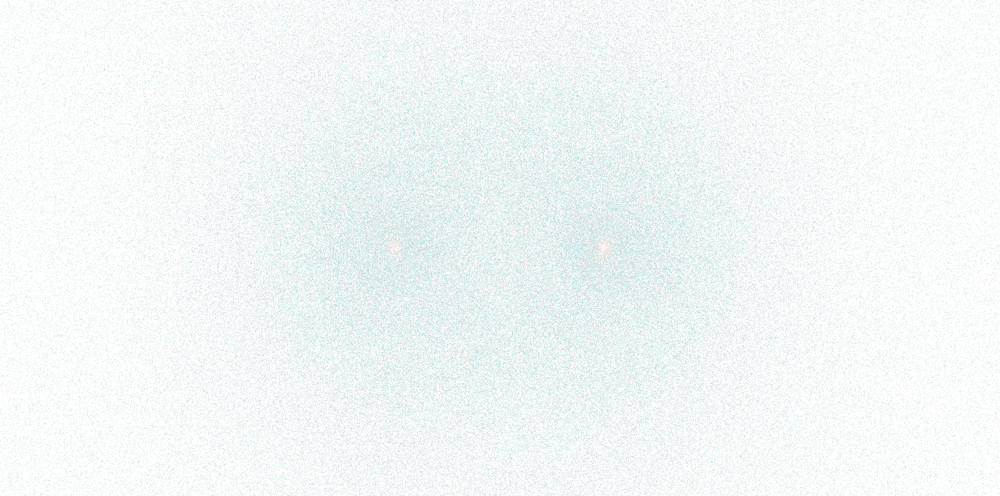

A Web Worker–multithreaded particle simulation that targets 60 FPS simulating 1,000,000 particles and their movements in the browser (using gravity!) without relying on WebAssembly or GPU APIs. This project is a proof-of-concept for CPU-side concurrency and rendering performance using `SharedArrayBuffer` and double-buffered pixel data. 

## Features
- **Multithreaded simulation and rendering** using a worker pool sized to available CPU cores.
- **SharedArrayBuffer-based data flow** for particle state, simulation metadata, and pixel output.
- **Double-buffered rendering** to solve flickering due to multithreaded-rendering.
- **Perf telemetry UI** (FPS, frame time, render time) via `lil-gui`.
- **Cross-origin isolation support** via the `coi-serviceworker.js` helper and Vite plugin.

## Architecture overview
1. **Main thread controller (`src/sim.ts`)**
   - Drives the animation loop, swaps render buffers, and dispatches simulation work to the worker pool.
2. **Worker threads (`src/worker.ts`)**
   - Update particle positions/velocities and write RGBA data into the shared pixel buffer.
3. **Renderer (`src/render.ts`)**
   - Composites per-worker pixel chunks into a final `ImageData` buffer and draws to the canvas.
4. **Initialization (`src/init.ts`)**
   - Seeds particles, spins up workers, and prepares gravity field test data.

## Getting started
### Prerequisites
- Node.js 18+ (or a recent LTS)
- npm

### Install
```bash
npm install
```

### Run locally (recommended with Vite)
This repo is set up for Vite-style dev servers. If you don’t have Vite installed globally, `npx` will download it on demand.
```bash
npx vite
```

Then open the URL printed by Vite (usually `http://localhost:5173`).

> **Note:** This project relies on `SharedArrayBuffer`, which requires cross-origin isolation. The included `coi-serviceworker.js` and `vite-plugin-cross-origin-isolation` help enable this in development.

## Project layout
```
src/
  index.ts        # App entrypoint, UI, and startup wiring
  init.ts         # Worker bootstrapping + initial conditions
  sim.ts          # Main-thread simulation controller
  render.ts       # Pixel buffer compositing + canvas rendering
  worker.ts       # Worker-side simulation + pixel writes
  structs/
    global.ts     # Shared constants + buffers
```

## Notes & limitations
- This is a **CPU-side** experiment and intentionally avoids GPU APIs (e.g., WebGL/WebGPU).
- Performance will vary by hardware and core count.

## License
See [LICENSE](./LICENSE).